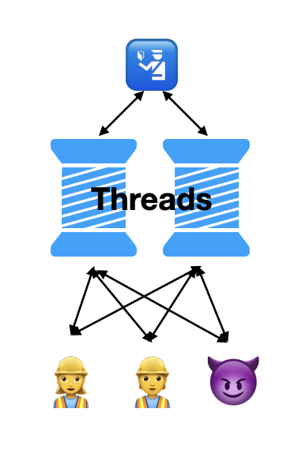
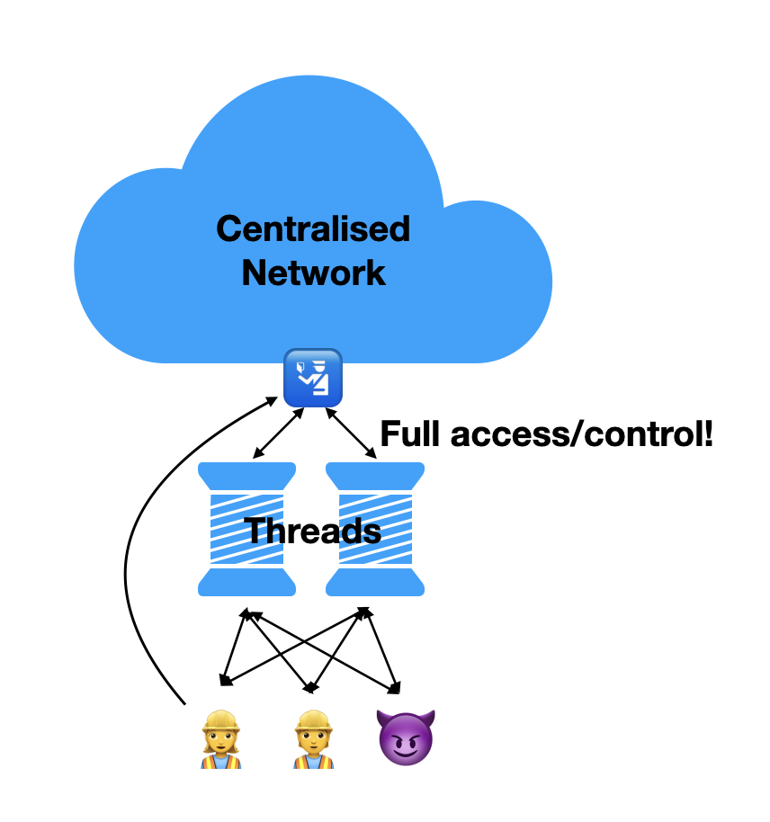
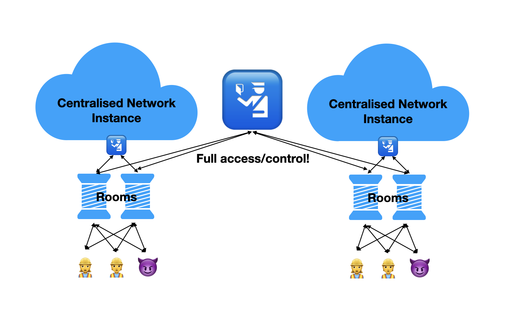
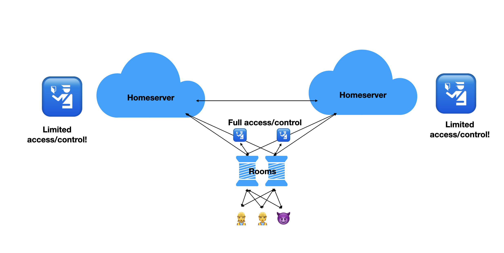
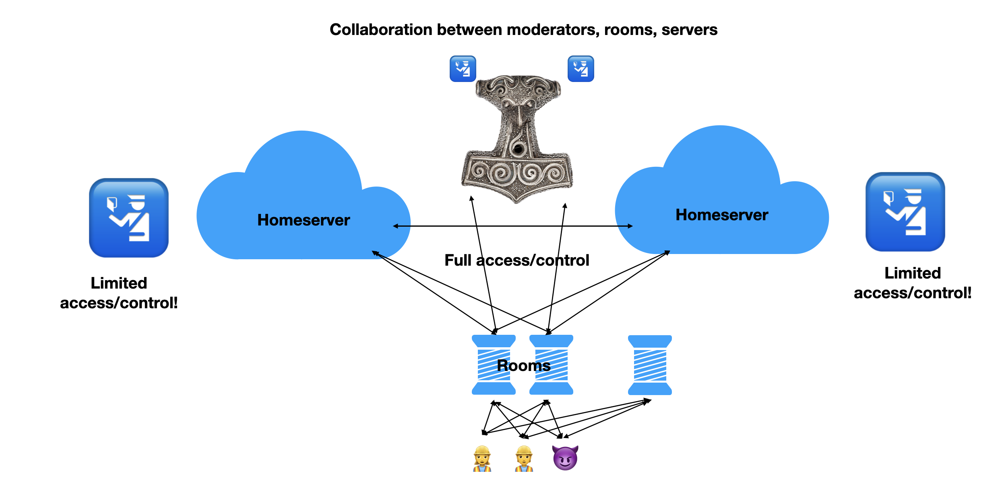

# Decentralizing Moderation

- [Yoric](https://github.com/Yoric) (aka David Teller) [OPEN TO WORK]
- [Gnuxie](https://github.com/Gnuxie) [OPEN TO WORK]
- [Jesopo](http://github.com/Jesopo) [OPEN TO WORK]

~~the Element T&S Dev Team~~

---

# I. Moderation

---

## What is moderation?

<ol>
<li>Abuse happens.</li>
<li>Moderator is informed.</li>
<li>Moderator takes action.</li>
</ol>

---

## The Twitter Model

 </img>

---

## The Discord Model

 </img>

---

## The Federated Model

 </img>

---

## Mjölnir = Federated Moderation

 </img>

---

# Installing Mjölnir

---

## Installing Mjölnir
### It's very simple

1. Create an account.
2. Create a policy room.
3. Create a moderation room.
4. Find the token for the account.
5. Find the room id for the policy room.
6. Find the room id for the moderation room.

---

## Installing Mjölnir, continued

### It's simple, don't worry

7. Grant Mjölnir rights to the policy room.
8. Grant Mjölnir rights to the moderation room.
9. Invite Mjölnir in the community room.
10. Grant Mjölnir rights in the community room.

---

## Installing Mjölnir, continued
### It's... not so simple?

11. Read the documentation for Mjölnir's config file.
12. Write Mjölnir's config file.
13. Obtain hosting.
14. Install and configure `pantalaimon` on your host.
15. (Optionally) install and configure `nginx` on your host.
16. (Optionally) install and configure Sentry on your host.

---

## Installing Mjölnir, continued
### Wait, it's not finished?

17. Install `docker-compose` on your host.
18. Write a `docker-compose.yml` for Mjölnir, `pantalaimon`, (optionally) `nginx`.
19. Start the binary.
20. Monitor logs.
21. (Optionally) Monitor Sentry.

---

## Installing Mjölnir, continued
### Are we done yet?

22. Keep watch for new releases of Mjölnir.
23. Keep watch for changes in the config file.

---

## Installing Mjölnir, continued
### Are we done yet?

24) Congratulations, you're the proud moderator of a few rooms.
25) If you wish to have a different set of moderators for other rooms, repeat steps 1-24.

---

# Introducing Mjölnir-for-all

- [Gnuxie](https://github.com/Gnuxie) [OPEN TO WORK]
- [Jesopo](http://github.com/Jesopo) [OPEN TO WORK]

---

## What we'd like.
### Setting up moderation

1. Invite `@mjolnir`.
2. Make `@mjolnir` moderator.

---

## What we get.

TBD: Demo

---

## Or that.

TBD: Demo

---

# Now, let's send a moderation request!

---

# Now, let's send a moderation request!
## Send the request...

TBD

---

# Now, let's send a moderation request!
## ...receive the request

TBD

---

# Aristotle
## Decentralizing Moderation Requests

- [Yoric](https://github.com/Yoric)

TBD

---

## What we'd like

TBD

---

## What we get

Demo

---

# Where we are at

* Development started at Element.
* Latest version lives at https://github.com/Gnuxie/Draupnir .

---

# That's all, Folks!

- [Yoric](https://github.com/Yoric) (aka David Teller) [OPEN TO WORK]
- [Gnuxie](https://github.com/Gnuxie) [OPEN TO WORK]
- [Jesopo](http://github.com/Jesopo) [OPEN TO WORK]

TBD